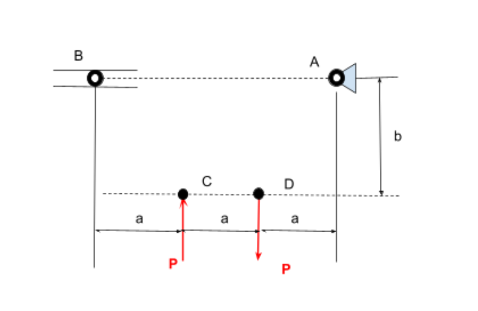
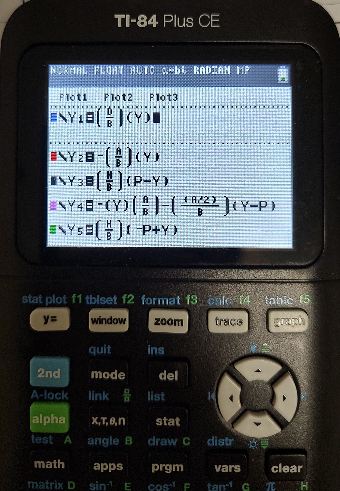
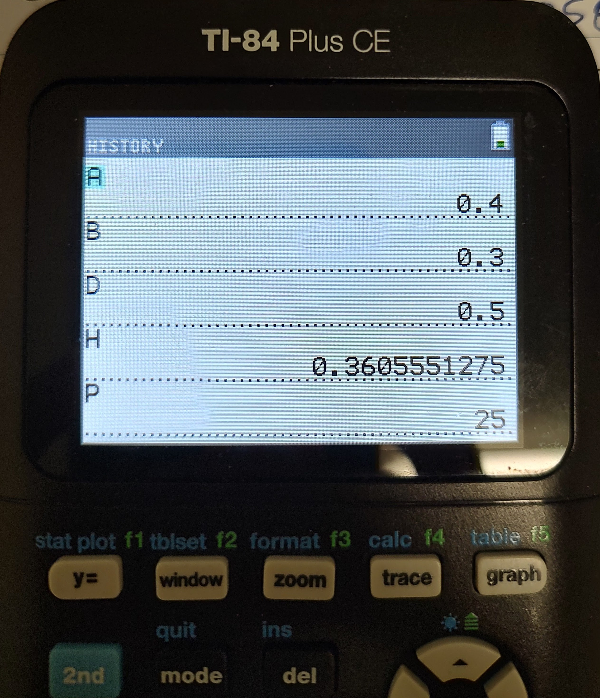
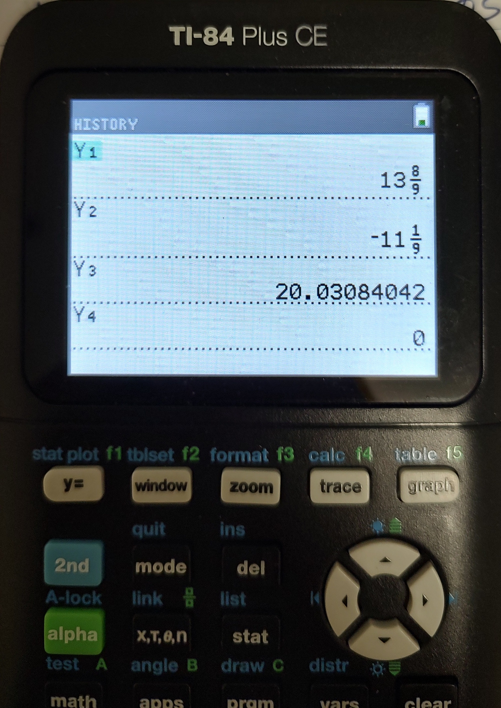

# A2 – Truss Stress Analysis

For the second assignment, we were tasked with designing a simple truss to support two loads attached to two supports. 

## Objective

The truss is meant to support two equal loads P which are between 20 and 30 kilonewtons pointing in opposite directions. The truss is mounted to a roller on the left at point B and a pin support on the right at point A. The distances between the points were given with a = 0.4 meters being the horizontal distance between each point and b = 0.3 meters being the vertical distance from the lower points to the higher points. 

## Truss Design

The truss I drew is the simplest and most direct one that could be drawn. However, there are benefits in the simplicity of the design, such as needing a fewer number of total parts and a lesser chance of connection points failing. 

The truss I designed is composed of three equilateral triangles directly attached to the four points. This creates five points of intersections and seven beams composing the truss. To connect the seven beams, five pins are needed to hold the truss together. The design of the truss maximizes stability using the most amount of triangles possible while also minimizing the number of parts, thus minimizing weight and complexity. 

The forces of the truss was broken down and analyzed to determine the highest internal force which would be used to find the minimal cross-sectional area the beams and pins should have to ensure the truss can support the loads safely. The forces were first calculated symbolically then numerically. The external support forces were calculated first, which consisted of two forces at point A, Ay and Ax, and one force at point B, By, since it is a roller.

**External Force Calculations**

<iframe src="A02-Ext-force-calc.pdf" width="100%" height="600px" type="application/pdf">
  
Your browser does not support PDFs. <a href="A02-Ext-force-calc.pdf">Download the PDF</a>.

</iframe>

Once the external forces Ay, By, and Ax were calculated, the internal forces were analyzed using method of joints. The internal forces were calculated using four of the five points since the fifth point would be redundant. Pin A, B, C, and D were analyzed to obtain all seven internal forces.

**Internal Force Calculations**

<iframe src="A02-Int-forces-work.pdf" width="100%" height="600px" type="application/pdf">
  
Your browser does not support PDFs. <a href="A02-Int-forces-work.pdf">Download the PDF</a>.

</iframe>

Once the equations for all of the external and internal forces were found symbolically, numbers could be plugged in. The distances of a = 0.4 meter and b = 0.3 meters were used to the hypotenuse distances of the triangles. The distance d of the outside triangles was found using the Pythagorean theorem to be 0.5 meters. The distance of the internal triangle was smaller because the x-distance was in the center of an 0.4 meter segment. The distance h of the internal triangles was found to be ~0.361 meters. 

The Assignment gave a range for the P values to be between 20 and 30 kilonewtons. I chose the value right in the middle and set P = 25 kN. With the force of P and the all of the distances solved for, all internal forces could be solved numerically. 

**Numerical Force Calculations**

<iframe src="A02-Numerical-work.pdf" width="100%" height="600px" type="application/pdf">
  
Your browser does not support PDFs. <a href="A02-Numerical-work.pdf">Download the PDF</a>.

</iframe>

I used my Ti-84 calculator to create variables and equations for each support force, distance, and load to try and minimize mathematical error and save time.

The support forces were verified by plugging into back into the sum of forces equations used in the individual pin analysis. Since the internal forces should sum to zero, plugging back in the numbers acquired for the internal forces will verify that the numbers are correct if the results are zero. 

**Numerical Force Verification**

<iframe src="A02-Verifying-Numbers.pdf" width="100%" height="600px" type="application/pdf">
  
Your browser does not support PDFs. <a href="A02-Verifying-Numbers.pdf">Download the PDF</a>.

</iframe>

If the calculations are correct, the forces summed to zero meaning that the numbers should be correct. This meant the largest internal forces were DE and CE at 20.031 kN in tension and compression respectively. The interesting result was the math showing that the force CD between the points with the loads was zero. This implies that the beam between C and D could be removed to save weight or cost but that could potentially cause stability issues.

This was the second attempt at calculating the internal forces. The first attempt had the wrong sign on the external force By by which led to all of the internal forces being wrong. CE ended up around 40 kN of force, which was unreasonable and the verification of the forces using the sum of forces equations did not sum to zero. 

**Incorrect Force Calculations**

<iframe src="A02-Initial-Wrong-Work.pdf" width="100%" height="600px" type="application/pdf">
  
Your browser does not support PDFs. <a href="A02-Initial-Wrong-Work.pdf">Download the PDF</a>.

</iframe>

Using the new correct numbers, the internal cross sectional area need for the beams could be found using the largest force, being 20.031 kN, and a safety factor of 3.5. The yield strength used was 33,000 psi or 228 megapascals for Grade A A500 steel which was found using multiple sources that listed a range of 33,000 to ~50,000 psi. I went with the low end of 33,000 psi for additional safety. 

**Safety and Stress Calculations**

<iframe src="A02-Beam-Safety-Calc.pdf" width="100%" height="600px" type="application/pdf">
  
Your browser does not support PDFs. <a href="A02-Beam-Safety-Calc.pdf">Download the PDF</a>.

</iframe>

The minimum cross-sectional area that would fulfill the given restrictions was found to be approximately 307.49 mm^2. Solving for the radius, the radius ended up being ~9.8933 mm. I decided to round up to 10 mm though to make calculations easier. This meant that the diameter would be 20 mm. 

Using the same sources that listed the yield strength of grade A A500 steel, the number given for the density of A500 steel was 7800 kg/m^3. This density was then used to calculated the weights of the seven individual beams. The weights were then summed to find the total weight of the truss.

**Weight Calculation**

<iframe src="A02-Truss-weight-calc.pdf" width="100%" height="600px" type="application/pdf">
  
Your browser does not support PDFs. <a href="A02-Truss-weight-calc.pdf">Download the PDF</a>.

</iframe>

The total wight of the 20 mm diameter beams was calculated to be 8.138 kg. 

## Pin Calculations

The minimal cross-sectional area of the pins was then calculated using the given numbers from the assignment. The assignment listed a shear yield strength of 170 ksi (converted to 1172.11 MPa) and a density of 0.278 lbs/in^3 (converted to 7695.0135 kg/m^3). The pin at point E was sampled because four beams overlap at that point meaning the shear stress would be the highest. 

**Shear Stress Pin Calculation**

<iframe src="A02-Pin-force-calc.pdf" width="100%" height="600px" type="application/pdf">
  
Your browser does not support PDFs. <a href="A02-Pin-force-calc.pdf">Download the PDF</a>.

</iframe>

After a couple math mistakes, the minimum cross-sectional area was determined to be ~35.426 mm^2. Solving for the radius gave a radius of 3.36 mm and thus a pin diameter of 6.72 mm. The longest length chosen was 80 mm which was needed for the pin at point E to pass through the four 20 mm diameter beams. The weight of one pin was determined using the density of 7695.0135 kg/m^3. 

**Pin Weight Calculations**

<iframe src="A02-Pin-weight-calc.pdf" width="100%" height="600px" type="application/pdf">
  
Your browser does not support PDFs. <a href="A02-Pin-weight-calc.pdf">Download the PDF</a>.

</iframe>

The weight of one pin with the given density was determined to be 0.0218 kg or 21.8 grams. To find the weight of all five of the needed pins, the found weight was multiplied by five giving a total weight of 0.109 kg for all five pins. 

The total calculated weight of the truss could then be calculated by adding the weight of the beams and the weight of pins. The calculation yielded a weight of 8.247 kg for the entire assembly.

With the numbers calculated, the CAD modeling could begin.

## CAD Modeling the Truss

## Communicate

