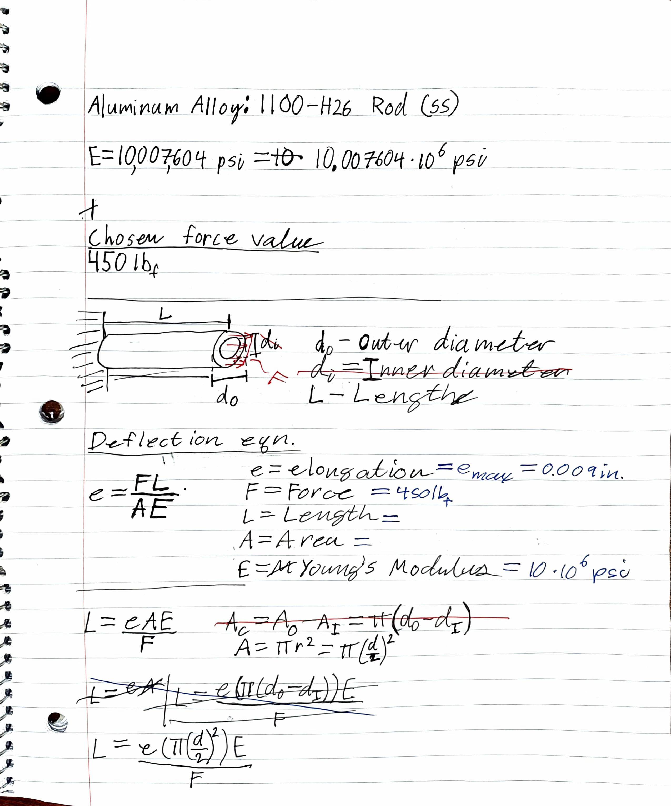
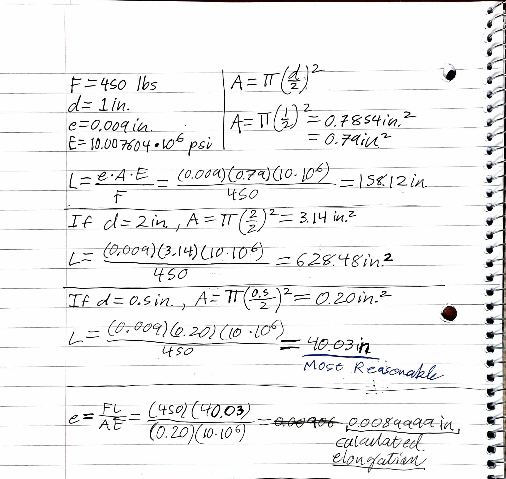
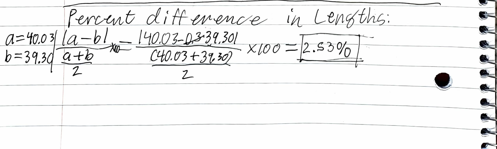
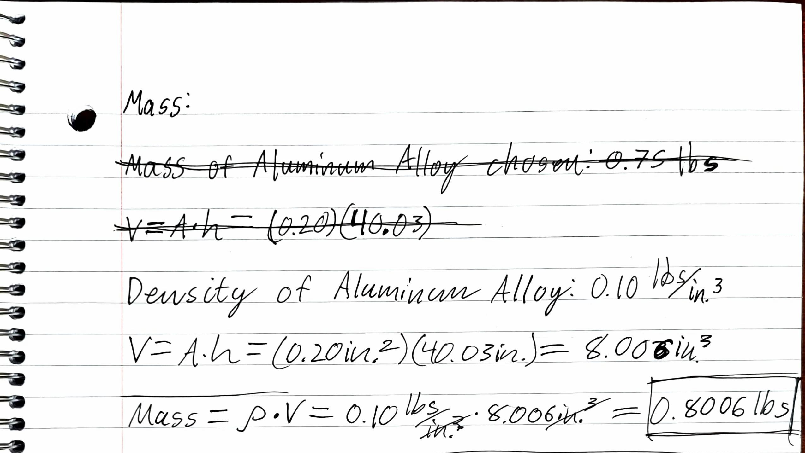
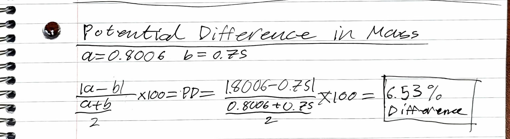
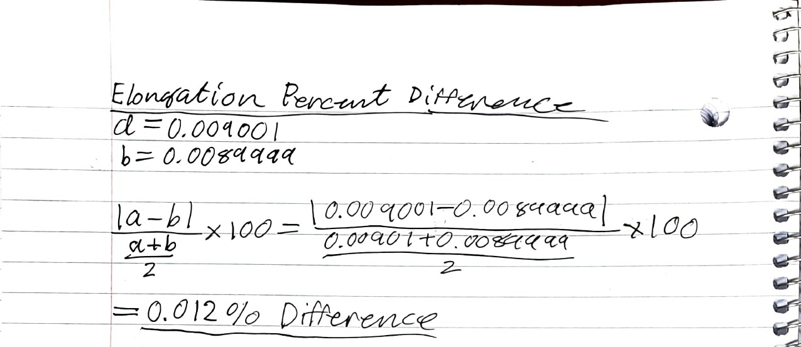
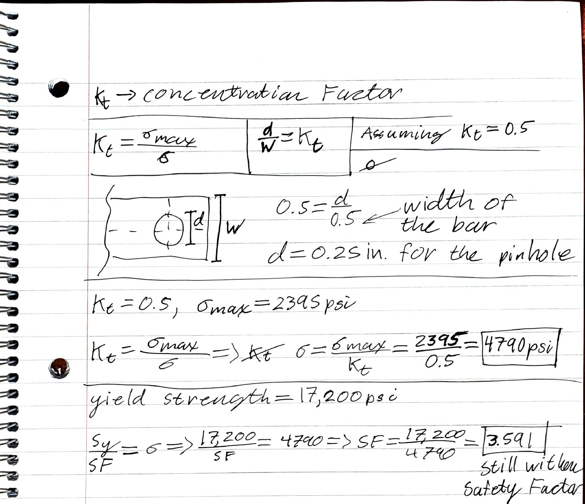

# A3 – Parametric & FEA

## Objective

The objective of assignment 3 is to create a bar with a circular cross section with a given maximum elongation value of 0.009 inches and an axial force between 300 and 500 pounds. The goal is to model the bar parametrically using the built in function and equation features of CAD software to parametrically determine the length of the bar. Then, the bar will undergo Finite Element Analysis and a stress and displacement simulation within the CAD Software to determine its properties..

## Bar Calculations

To start, a material was first selected. The assignment calls for the bar to be made of Aluminum with an Elastic Modulus between 8.5 * 10^6 and 11.5 * 10^6 psi. After looking through the different Aluminum Alloys Solidworks had preinstalled, I went with 1100-H26 Rod (SS) which had an Elastic Modulus of 10.007604*10^6 psi. 

With the material decided, I first performed my hand calculations with multiple sizes of the diameter. I decided on a force of 450 pounds to be a little closer to the high end. I used 2, 1, and 0.5 inches for the diameter and settled for the 0.5 inch diameter because it had the shortest length of 40.03 inches. Calculating the 2 inch diameter produced a length of 630 inches, which felt a bit large for my purposes. I then used my length, area, force, and Elastic Modulus to calculate the approximate elongation which came out to be approximately 0.0089999 inches or essentially 0.009 inches which was the maximum.

With the parameters decided on, I could start creating the variables in Solidworks and playing around with the dimensions. I played with the diameter a bit more but the numbers the calculations gave were about the same as I had calculated by hand. Thus, I still ended up using 0.5 inches as my diameter.  

* Very unreasonable length for the 

* Much more reasonable length relative to the diameter.

The length calculated by Solidworks was closer to 39.30 inches or about 0.73 inches shorter than the 40.03 inch length I calculated by hand. This meant there was a 2.53% difference in the lengths.

## Bar Design

Once I had the variables in place, I began modeling. The beam was very simple, just a cylinder with the dimensions bounded to the variables. 

* The Circle at the Base with the diameter bounded to the variable "d".

* The bar was then extruded to the length of "L" or 39.30 inches.

Once the length and diameter parameters were in, those were all the measurements I needed for the bar and I could move on to the Finite Element Analysis and parametric testing in Solidworks. However, before that, I calculated the weight of the bar. The Aluminum Alloy 1100-H26 Rod (SS) I used had a density of 0.10 lbs/in.^3. I calculated the volume to be 8.006 in.^3 by multiplying the Area of the base, 0.20 in.^3, by the calculated height of 40.03 inches. This produced a weight of 0.8006 pounds. This felt light for a beam that was 40 inches long, but Solidworks produced a similar result at 0.75 lbs.

Calculating the percent difference gave a difference between the two masses of 6.53%, which is reasonably small. One cause of error is the difference in lengths from my hand calculations with the Solidworks calculations with the Solidworks calculations likely being more precise.

### Initial Incorrect Bar Calculations

Initially, when I started making the bar, I thought it was a hollow circular bar with an inner and outer diameter. This made the length calculations output a much larger number than I felt seemed reasonable. However, I went ahead and started modeling a hollow beam.

The plan was to have an outer diameter of 2 inches and an inner diameter of 1.8 inches. This produced a length of approximately 120 inches which seemed like far too much. And, after double checking my calculations, I finally looked back through the instructions and saw that it didn't say anything about a hollow beam. I then redid my calculations and CAD modeling, this time with a solid beam. 

## Finite Element Analysis

The next step in the process was to simulate the bar with the chosen load of 450 lbs on one side with the other being fixed. I used Solidworks' free Simulation Xpress Analysis Wizard tool to perform the Finite Element Analysis. I first had to set up the bar with correct conditions by fixing the beam in place on one end and applying the tensile force on the other end.

* Fixing one end of the bar

* Application of the 450 pound force to the other end of the bar

* Both the force and fixed surface applied

Once I had the force applied and one end fixed, I had verify the material. 

With the correct material, force, and fixed surface, I could then simulate the bar under load. 

The Solidworks Simulation Xpress produced Von Mises stress, Displacement, Factor of Safety, and Deformation in the form of an animation. Solidworks does exaggerate how far the bar actually displaces to make it more obvious since real world changes are generally near invisible to the naked eye.

* Von Mises stress graph with the maximum stress at 2.395 * 10^3 psi

* Displacement Graph with the maximum displacement reaching 9.001 * 10^-3 inches

* The first picture shows where the safety factor is below 1 and the second is where it is below 8. The lowest factor of safety found was 7.18255

With the data collected, I could draw some actual results from the FEA study.

### FEA Results

Using the numbers given from the result of the study, it can be determined that the maximum stress of 2,395 psi is below the yield point of the Aluminum Alloy at 17,200 psi. This means the force of 450 pounds isn't even close to breaking the bar. Assuming a yield strength if 40 ksi or 40,000 psi puts the stress value even further below the yield point. 

The calculated lowest safety factor in the simulation was found to be 7.18255. This is a very high safety factor for the bar which is consistent with the low maximum stress compared to the yield strength of the Aluminum Alloy.

The results from the displacement show a maximum displacement of 0.009001 inches which is very close to the maximum allowed elongation of 0.009 inches. The elongation I hand calculated was about 0.0089999 inches, right below the 0.009. The percent difference between the hand calculated and FEA calculated is 0.012% which is practically 0%. This is to be expected since the length of the bar in both the hand and Solidworks calculations were done using the maximum elongation of 0.009 inches. Thus, the calculations produced the length of bar which would stretch approximate 0.009 inches when subject to a tensile force of 450 pounds. There aren't any other parameters that were used to measure thus the calculated length is a minimum length that a bar of this composition would have to be to stretch a maximum of 0.009 inches when subjected to the axial 450 pound force.

### Stress Concentration Factor

The assignment asks for the stress in a fairly substantial pin hole in the left side of the bar. Since the assignment gives no concrete numbers, I looked at a table of stress concentrations and chose one. I chose a stress concentration of 0.5 which meant the pin would have a diameter of 0.25 inches. Using the stress concentration and the maximum stress given from the stress analysis of the bar which was 2395 psi, I could calculate the new total stress that would be in the bar. I calculated the stress to be 4790 psi with the pin hole. This still had a reasonable safety factor at 3.591, albeit about half as much which was to be expected. The stress was also well below the yield point of 17,200 psi.

## Study Conclusions and Lessons Learned

Overall, the beam was proven to be able to withstand the 450 pound force while only elongating to the maximum length of 0.009 inches. I would put more trust in the calculated Solidworks model over my hand calculated model because it is more precise, using more decimal places, has more data, and is less prone to mistakes (so long as the initial values and formulas are correct). 

I learned a lot during this assignment. I had never run a proper CAD simulation before and it was very interesting learning to set it up. Same with Finite Element Analysis which I hadn't heard of before this assignment.  Stress concentrations also were not something I had been exposed to before and while I don't fully understand the concept, it seems interesting with how different indents or punctures in a part can have massive effects on the stress. And I now know how to at least somewhat calculate them.

[Bar STL Download](A03-Bar.STL)

**Time Spent on this assignment: 6 Hours**

### Modified Design Parameters

The goal of this section was to change the parameters like the diameter and force and guessing how the length would change. I, unknowingly, did this at the beginning when I was first calculating the dimensions for the beam. I tested several different sizes of diameter and quickly determined that the bigger the diameter, the length gets much bigger in comparison. The change in lengths between 0.5 inches and 1 inch (~40 in. to ~120 in.) was already huge but the change from 1 inch to 2 inches (~120 in. to ~630 in.) was massive. I also decided to play around with the force and my assumption was that as the force decreased, the length would increase. And I was proven correct. Changing the force from 450 pounds to 300 pounds increased the length from 39.3 inches to 59.95 inches. I didn't try messing with the elastic modulus or the the maximum elongation number but my assumptions would be as you increase the elastic modulus, the length will increase and as you decrease the maximum elongation number, length will decrease.

## Resources

* [Solidworks](https://www.solidworks.com/)

* [Solidworks Simluation Xpress](https://help.solidworks.com/2015/english/SolidWorks/cosmosxpresshelp/c_Overview_of_SOLIDWORKS_SimulationXpress.htm)

* [Stress Concentration Factors for Engineering Design](https://www.roymech.co.uk/Useful_Tables/Fatigue/Stress_concentration.html)

