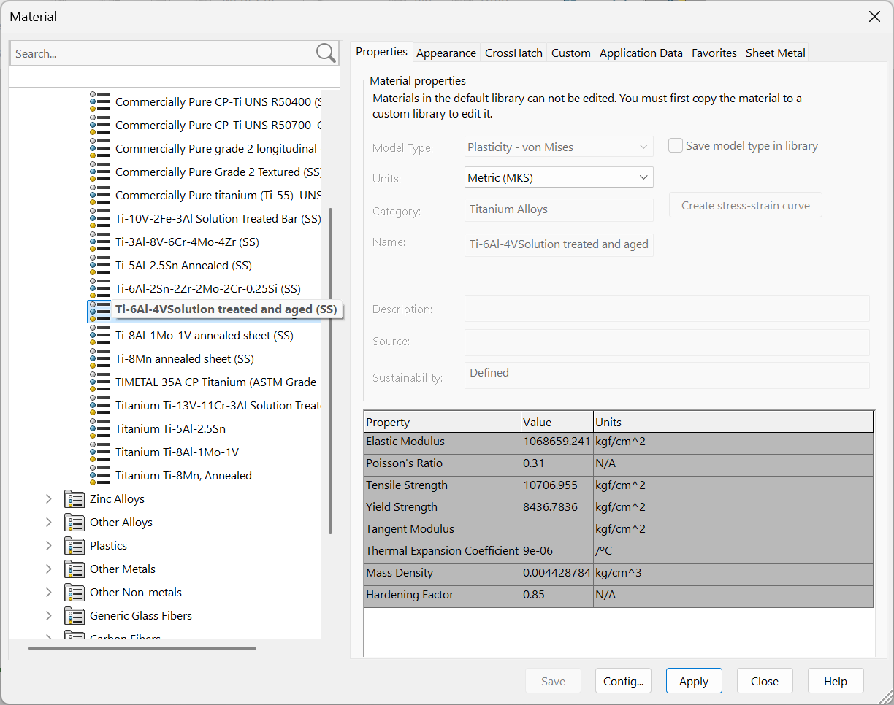

# A5 – Bracket Design

## Objective

The objective of the fifth assignment was to design a bracket to fit over a T beam and support a load on a string. 

The force F was a chosen force between 500 and 800 lbf following the outlined dimensions of the T beam. The bracket was to be made out of one of the three metals: aluminum 6061 T6, Steel (ASTM A36), or Titanium (Ti-6Al-V4). There was assumed to be no failure due to shear stress meaning no shear stress calculations were necessary. The cable (in this case [Uline Heavy Duty Polyester Cord Strapping](https://www.uline.com/Product/Detail/S-12925/Poly-Cord-Strapping/Heavy-Duty-Polyester-Cord-Strapping-3-4-x-2500?pricode=WA9239&gadtype=pla&id=S-12925)) is 0.75 inches in width meaning the minimum length of the cylinder feature connected to the bracket was 0.75 inches. A safety factor of 4 was to be used for the yield strength and max stress.

The assignment required two multi view sketches, one of a stress analysis and the other of a stiffness analysis, to be sketched on paper.

## Stress and Stiffness analysis

The assignment required an analysis of the bracket in terms of stress and stiffness. I calculated for both simultaneously in my design, choosing the parameter that was larger to go with. However, most of the parameters didn't change much. There weren't many features I calculated for stress and stiffness that other parts were dependent on which allowed me to look back at the numbers I had already calculated to be able to create both sketches. Some parameters were only able to be calculated using either the stress equation or deformation equation which meant those numbers had to stay the same.

### Feature Breakdown

For the bracket design, there were five features that required analysis. The cylinder feature needed to be able to hold the cable with the load acting on it. Connecting to the cylinder feature was a supporting beam the needed to connect the cylinder to the main bracket body. The bracket itself consisted of three rectangles that surrounded the T beam, with each on needing to be analyzed to find the appropriate wall thicknesses and heights of each rectangle. The dimensions of one 

For the analysis of each feature, I started at the bottom with the cylinder feature closest to the load and carried up the necessary numbers to each subsequent feature. 

### Parameters and Assumptions

The force I chose was 600 lbf on the cable. This meant there was 2 times this force acting on the cylinder feature that I needed to account for. This force would be carried through the entire bracket. The primary assumption that made the calculations easier was assuming no failure from shear stress. This meant shear stress could be neglected and normal stress and deflection or stiffness were the only parameters that needed to be calculated around.

For the metal of the bracket, I chose Titanium (Ti-6Al-V4). I derived my numbers for yield strength and the elastic modulus from Solidworks. 

### Cylinder Feature

For the cylinder feature, I treated it as a cantilever beam. the length was fixed at 0.75 inches, at least as a minimum, which meant I needed to calculate radius. I solved the maximum stress equation for a cantilever beam with a distributed load using the moment of inertia for a cylindrical body to get the radius. I did the same with the deformation equation, solving the equation for the radius

**_Radius eqns_**

Once I had the equations solved, I could find the radius.

**_Radius num work_**

I found the minimum radius for the maximum stress and maximum deflection.

**_Radius number work_**

I calculated a minimum radius for the stress to be 0.168 inches and a minimum radius for stiffness to be 0.152 inches. I multiplied the numbers by 2 to find the diameter and used the numbers for the width of the supporting beam. 

One assumption I made after when I moved on to creating the main body of the bracket was to make the bracket the same thickness or length of the cylinder. This meant that every feature, excluding the supporting beam, was 0.75 inches thick. 

### Supporting Beam Feature

For the supporting beam which attaches the cylinder to the main beam, I modeled it as a beam with an axial force and the deflection as a cantilever beam. This meant I used the stress equation for cross sectional area. I set the width if the supporting beam to be 2 times the radius (a.k.a. the diameter) of the cylinder feature so that the two would be flush when connected. This made the thickness the only unknown which was what I calculated for. 

**_Solved w eqns works_**

However, I realized that for the deformation equation, I needed the length or height of the bar. I didn't know what to set it as because there was another feature that needed to fit under it. There was a linkage feature to be designed that had to slip onto the cylindrical feature meaning the support beam needed to give enough clearance to allow the linkage to fit. Since I didn't want to just guess, I went ahead and modeled the linkage.

### Linkage

The linkage feature was to be designed to be able to slip over the cylinder feature and have another hole below that to fit a 1 inch diameter shaft. I used the radius I got from solving for the stress on the cylinder to get the diameter of the top hole and used 1 inch for the diameter of the lower hole. 

**_Linkage inital dtawing_**

I assumed both fits for the cylinder feature and 1 inch shaft to be RC2 Running/sliding fits. This was because I figured the linkage shouldn't be able to spin freely but also didn't need the most precision it could have.

Using the RC2 numbers from the table on page **_INSSERT PAGE NUM_** of the Machinery's Handbook, I determined the minimum and maximum possible diameters from the given clearances.

**_MAX MIN DIAMETERS_**

Using the maximum diameter for the 1 inch hole, I calculated the minimum cross sectional area from the cross section of the linkage at the 1 inch diameter hole. This is where the cross sectional area in the linkage was the least meaning the this area had to be enough to hold the axial load of 2 times 600 lbf or 1200 lbf in total.

**_AREA SOLUTIOn_**

Once I had calculated the minimum cross sectional area of the linkage, I set the width equal to an arbitrary measurement and solved for the thickness. 

In this case, I set the width, I called x, equal to 0.05 inches. Since the cross sectional area came out to be 0.020 inches, this gave me a length or thickness, y, equal to 0.04 inches.

**_AREA DIMS CALC_**

Using the radius from the 1 inch diameter hole, I added 2 times the width, x, to the diameter to find the total width of the linkage which came out to be 1.1005 inches. I used the radius from the 

**_TOTAL WIDTH OF LINKAFE_**

This allowed me to fully dimension everything. I solved for the minimum radius of the linkage for the curved edges which came out to be one half of the diameter plus the width of the cross sectional area, x, making 0.55025 inches for the diameter or 1.1005 inches for the total width of the linkage.

**_MIN RAD MATH_**

With that, I could put all the dimensions in a multi view sketch.

**_LINKAGE MULTI VIEW SKETCH_**

### Supporting Beam Feature Finished

Once I had the linkage calculated, I could take the height or radius from the center of the top hole to the rounded edge of the linkage and use that as my height. I opted to use twice the linkage radius to leave extra space between the linkage and the bottom of the bracket.

I then calculated for the width or thickness of the supporting beam using the maximum stress and deformation equations.

**_SUPPORTING BEAM CALCS_**

With the calculations done, the thickness from the stress equation came out to be double the deformation equation. So I went with the stress width. Although, no further calculations down the line would rely on these numbers.

I took all of my dimensions and drew a multi view sketch of the supporting beam.

**_SUPPORTING BEAM SKETCGH_**

## Breaking down the Bracket

The bracket was to be made up of several rectangles. For simplicity, I kept the bracket as rectangles with no weird shapes and broke up the rectangles. Making use of symmetry allowed me to cut the force in half from two times the force to just the magnitude of the force or 600 lbf. 

**_FIGURE BNREAKDOWN_**

This gave me three rectangles I needed to calculated the dimensions for. The assumptions made were that the bracket would be as thick as the cylinder feature, 0.75 inches, and that there would be no failure due to shear stress. I also assumed perfect symmetry and calculated only half of the bracket. 

The dimensions of the T beam were given and since it was meant to be a fit, I used the same dimensions for the bracket components. 

### Feature 1 of the Bracket

The first feature of the bracket was the uppermost rectangle. I wasn't sure how to model it since it had two forces acting on it, The reaction force from the T beam and the reaction force for the 2nd bracket feature. I ended up cutting the figure in half, leaving me with two smaller rectangles that I modeled as having axial forces. When solving for the rectangle with the known width of b, it turns out I didn't have an unknown. So I just ended up seeing if the stress in that part of the feature was below the maximum stress, which it was. 

**_FEATURE 1 STRES VERUFUCATIUON_**

So instead, I moved to the second rectangle with the unknown width I called Z that would attach to the second feature of the bracket. I solved again modeling the rectangle as an axial stress for Z.

**_FINDING MIN Z_**

Once I found my Z of 0.027 inches, I solved the whole feature for the height using the deformation equation.

**_FEAT 1 HEIGHT_**

With the height found, I successfully had found all of the parameters for the first feature.

### Feature 2 of the Bracket

For feature 2, I again modeled it as a beam with an axial force. This feature was easier than the first one because I only had to break it into one rectangle. I solved for Z using the axial stress equation and axial deflection equation.

**_FEAT 2 STRESS STIFF CALC_**

The Z calculation for stress came out to be 

### Feature 3 of the Bracket

## Bracket Analysis

### Stress Analysis

### Stiffness Analysis

Governing failure mode: For at least one feature, state whether stress or stiffness governed the final dimension, and by how much (e.g., "stress required 0.25", stiffness required 0.31"). If they were close, say so — a near-tie is itself a lesson.

Error propagation: Identify one instance where a value from an earlier feature carried into a later one. Did an early error (or a late catch) change a downstream result? If nothing propagated incorrectly, state what check caught it before it could.

There were a couple times I thought I calculated something like the radius of the linkage wrong which affected the width of the linkage. I also used a lower deformation number (0.05 instead of 0.005) a couple times which made my values lower than 

Assumption sensitivity: Name one assumption you made (material choice, shear negligibility, load distribution, etc.) and describe what would change in your final dimensions if that assumption were wrong or different.

## Lessons Learned

## Resources

Machinery's Handbook 32nd Edition

[Uline Heavy Duty Polyester Cord Strapping](https://www.uline.com/Product/Detail/S-12925/Poly-Cord-Strapping/Heavy-Duty-Polyester-Cord-Strapping-3-4-x-2500?pricode=WA9239&gadtype=pla&id=S-12925)

